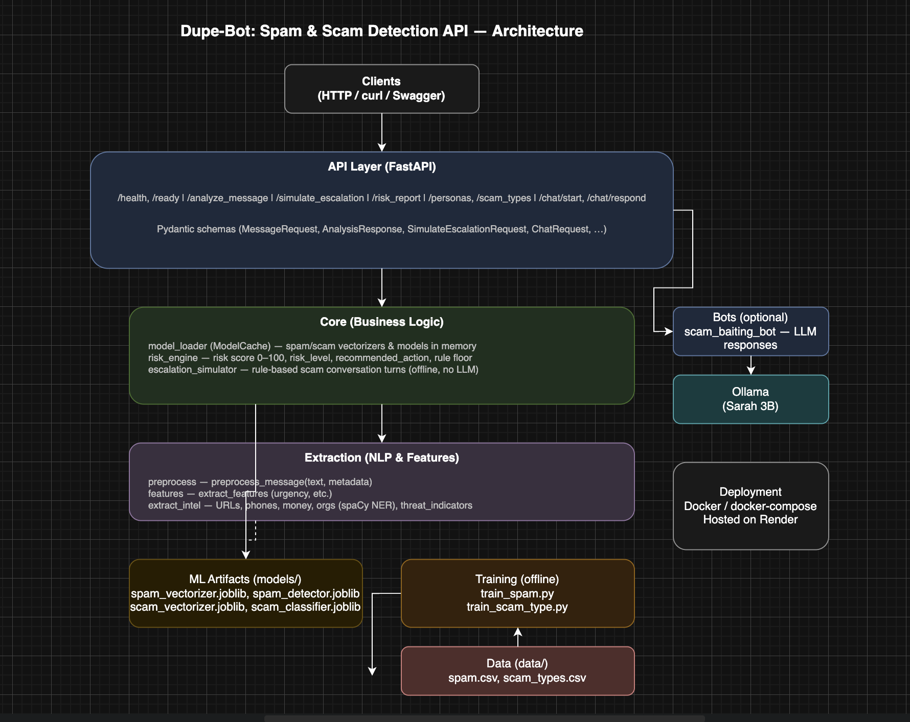

# Spam & Fraud Detection REST API

''A production-style REST API for spam detection, scam classification, threat intelligence extraction, rule-based escalation simulation, and risk scoring. Built to run on CPU-only infrastructure (Docker, deployed on [Render](https://render.com)).

---

## At a glance

| | |
|--|--|
| **Domain** | NLP, ML, fraud/spam detection, threat intelligence |
| **Backend** | Python 3.10+, FastAPI, Pydantic |
| **ML/NLP** | scikit-learn (TF-IDF, Logistic Regression), spaCy NER, custom feature pipelines |
| **Infra** | Docker, docker-compose, Render; optional Ollama/LLM locally |
| **Implementation** | REST API design, ML model training & serving, text preprocessing, NER, rule-based systems, containerization, cloud deployment |

---

## What this project demonstrates

- **End-to-end ML pipeline:** Trainable spam and scam-type classifiers, served via a single `/analyze_message` endpoint with confidence scores and processing-time metrics.
- **Structured threat extraction:** URLs, phone numbers, money amounts, organization names, and action phrases (spaCy NER + custom logic).
- **Risk and operations:** Configurable risk scoring (0–100), recommended actions, and rule-based escalation simulation (offline, no LLM dependency for core flow).
- **Production readiness:** Health/readiness probes, Docker images (with and without Ollama), deployed on Render, env-based configuration.

### Architecture

<p align="center">
  
</p>


---

## Features

- **Spam detection** — TF-IDF + Logistic Regression; returns `is_spam` and confidence.
- **Scam type classification** — bank_phishing, otp_scam, job_fraud, crypto_scam, lottery_scam, loan_scam, other.
- **Threat intelligence** — URLs, phone numbers, money amounts, org names (spaCy NER), action phrases.
- **Rule-based escalation simulation** — Offline simulation of N conversation turns (no LLM).
- **Risk score (0–100)** and **recommended action** with details.

---

## Quick start (run locally)

```bash
# Install
pip install -r requirements.txt
python -m spacy download en_core_web_sm

# Train models (from project root)
python -m training.train_spam
python -m training.train_scam_type

# Run API
uvicorn api.main:app --host 127.0.0.1 --port 8000
```

- **API:** http://127.0.0.1:8000  
- **Docs:** http://127.0.0.1:8000/docs  
- **Health:** http://127.0.0.1:8000/health | **Ready:** http://127.0.0.1:8000/ready  

---

## API endpoints

| Endpoint | Method | Description |
|----------|--------|-------------|
| `/health` | GET | Liveness probe |
| `/ready` | GET | Readiness (models loaded) |
| `/analyze_message` | POST | Full analysis: spam, scam type, intel, risk score, recommended action |
| `/simulate_escalation` | POST | Rule-based scam escalation (offline, no LLM) |
| `/risk_report` | GET | Last analysis risk report |
| `/personas`, `/scam_types` | GET | Reference data |

### Example: analyze a message

**POST /analyze_message**

```json
{
  "text": "URGENT! Your SBI account is blocked. Verify at http://sbi-fake.com. Call +91-xxxxxxxxxx",
  "sender": "+91-xxxxxxxxxx",
  "channel": "sms"
}
```

Response includes: `is_spam`, `spam_confidence`, `scam_type`, `scam_confidence`, `risk_score`, `risk_level`, `recommended_action`, `action_details`, `threat_intelligence` (urls, phones, money_amounts, organizations, threat_indicators), `features`, `processing_time_ms`.

### Example: simulate escalation (offline, rule-based)

**POST /simulate_escalation**

```json
{
  "scam_type": "bank_phishing",
  "num_turns": 5,
  "initial_message": "Your SBI account is blocked. Verify at http://sbi-fake.com"
}
```

Returns a list of escalation turns with `phase` and `scammer_message` (no external service calls).

---

## Docker

The Docker image can include:
- **Ollama** server for local LLM inference (optional).
- **Sarah model** (3B) from [Hugging Face](https://huggingface.co/Het0456/sarah), auto-downloaded.
- FastAPI server for spam/scam detection.

### Build and run

```bash
docker build -t spam-api .
docker run -p 8000:8000 -p 11434:11434 spam-api
```

First run downloads sarah.gguf (~2–3GB); later runs use cache.

### With docker-compose (recommended)

```bash
docker-compose up --build
```

- Starts Ollama on port 11434, imports sarah, runs FastAPI on port 8000.  
- **Memory:** sarah needs ~4–6GB RAM; give Docker at least 8GB.

- API: http://localhost:8000 | Ollama: http://localhost:11434

---

## Deployed on Render

The API is deployed on [Render](https://render.com). Use **/health** and **/ready** for health checks in your service configuration. The `Dockerfile.cloudrun` image (no Ollama) is suitable for Render’s Web Service.

---

## Environment variables

| Variable | Default | Description |
|----------|---------|-------------|
| `HOST` | `0.0.0.0` | Bind host |
| `PORT` | `8000` | Bind port |
| `API_VERSION` | `1.0.0` | API version string |
| `MODEL_DIR` | `./models` | Path to model files |

---

## Project structure

```
├── config.py              # Paths and env config
├── api/                   # API layer
│   ├── main.py            # FastAPI app
│   ├── schemas.py         # Pydantic models
│   └── routes/            # Health, analyze, simulation, reports, chat, reference
├── core/                  # Business logic
│   ├── model_loader.py    # Load/cache spam & scam models
│   ├── risk_engine.py     # Risk score & recommendations
│   └── escalation_simulator.py  # Rule-based escalation (offline)
├── extraction/            # Text & threat intel
│   ├── preprocess.py
│   ├── features.py
│   └── extract_intel.py
├── bots/                  # Conversational agents
│   └── scam_baiting_bot.py  # LLM-powered scam baiting
├── training/              # Model training
│   ├── train_spam.py
│   └── train_scam_type.py
├── data/                  # Training data
├── models/                # Trained model artifacts
├── Dockerfile
├── Dockerfile.cloudrun
├── docker-compose.yml
└── requirements.txt
```

---

## Requirements

- Python 3.10+
- CPU only (no GPU required)
